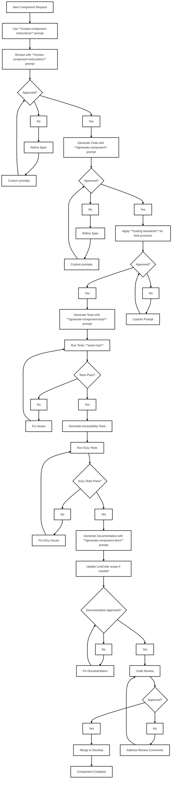

# AI Generation Workflow for Devs

AI-assisted headless component development with gated stages: spec → review → code → approval → coding standards → approval → tests → accessibility tests → fix loop → code review → merge.

## Development Flowchart



## Workflow Steps

1. New component request is created.
2. Create the component specification using `/create-component-instructions`.
3. Review the specification with `review-component-instructions.prompt.md`.
4. If not approved, refine the spec using custom prompts and re-run the review.
5. If approved, generate the code using `/generate-component`.
6. Perform code approval; if not approved, refine via custom prompts and re-generate.
7. If approved, apply coding standards to the generated code using `/coding-standards`.
8. Perform coding standards approval; if not approved, refine via custom prompts and re-apply standards.
9. If approved, generate tests with `/generate-component-tests`.
10. Run tests with `pnpm test`.
11. If tests fail, fix issues and re-run tests until they pass.
12. If tests pass, generate accessibility tests.
13. Run accessibility tests.
14. If accessibility tests fail, fix accessibility issues and re-run until they pass.
15. If accessibility tests pass, generate documentation using `/generate-component-docs`.
16. Update LiveCode scope if needed.
17. If documentation is not approved, fix documentation and re-run until it is approved.
18. If documentation is approved, proceed to code review.
19. If review is approved, merge to the `develop` branch.
20. Component is complete.

## Available Prompts

| Prompt                                      | Purpose                      | When to Use                    |
| ------------------------------------------- | ---------------------------- | ------------------------------ |
| `create-component-instructions.prompt.md`   | Component specifications     | New component development      |
| `coding-standards.prompt.md`                | Coding standards application | After code generation          |
| `review-component-instructions.prompt.md`   | Quality validation           | After spec creation            |
| `testing-guidelines.instructions.prompt.md` | Test specifications          | Before spec creation           |
| `generate-component.prompt.md`              | Code implementation          | After approved spec            |
| `generate-component-tests.prompt.md`        | Test generation              | After approved spec            |
| `generate-accessibility-tests.prompt.md`    | A11y test generation         | After basic tests pass         |
| `generate-component-docs.prompt.md`         | Documentation generation     | After accessibility tests pass |

## Chat Prompt Examples

### Component Development Workflow

```
/create-component-instructions Generate plan for Button component with variants, sizes, and loading states
```

```
/review-component-instructions Review Button component spec for accessibility and API completeness
```

```
/generate-component Implement Button component with full accessibility support
```

```
/coding-standards Apply coding standards to generated Button code
```

```
/generate-component-tests Create comprehensive tests for Button component including a11y
```

```
/generate-accessibility-tests Create dedicated accessibility tests for Button component with screen reader and keyboard navigation tests
```

```
/generate-component-docs Generate documentation for Button component
```

```
/code-refactoring Optimize Button component performance and improve TypeScript usage
```

### Real-world Examples

**Interactive Button:**

```
/create-component-instructions Design Button component with primary/secondary variants, loading states, and disabled mode
/review-component-instructions Validate Button accessibility compliance with keyboard navigation and screen reader support
/generate-component Build Button with compound pattern and ARIA attributes
/coding-standards Apply coding standards to generated Button code
/generate-component-tests Generate tests covering all button states and interactions
/generate-accessibility-tests Create dedicated accessibility tests for screen reader and keyboard navigation
/generate-component-docs Generate documentation for Button component
```

**Form Input:**

```
/create-component-instructions Create Input component with validation, error states, and label association
/generate-component Implement Input with proper ARIA labeling and error announcements
/coding-standards Apply coding standards to generated Input code
/generate-component-tests Create tests for input validation, keyboard navigation, and accessibility
/generate-accessibility-tests Generate dedicated accessibility tests for screen reader announcements and form validation
/generate-component-docs Generate documentation for Input component
```

**Navigation Menu:**

```
/create-component-instructions Design Menu component with keyboard navigation, focus management, and submenu support
/review-component-instructions Check Menu against ARIA authoring practices for menu patterns
/generate-component Build Menu with roving focus and proper ARIA attributes
/coding-standards Apply coding standards to generated Menu code
/generate-accessibility-tests Generate comprehensive accessibility tests for menu navigation patterns
/generate-component-docs Generate documentation for Menu component
```

## Key Rules

- Always use prompts in sequence
- Human review required before merge
- Accessibility first, performance second
- Zero styling, strict TypeScript
- Test coverage > 90%

## Quick Commands

- `pnpm test` - Run all tests
- `pnpm build` - Build package
- `pnpm lint` - Code quality check
