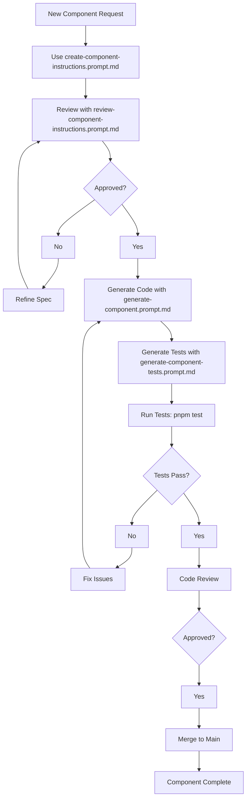

# AI Generation Workflow for Devs

## Overview

AI-driven headless component library development with prompt orchestration.

## Development Flowchart



## Available Prompts

| Prompt                                      | Purpose                  | When to Use               |
| ------------------------------------------- | ------------------------ | ------------------------- |
| `create-component-instructions.prompt.md`   | Component specifications | New component development |
| `review-component-instructions.prompt.md`   | Quality validation       | After spec creation       |
| `testing-guidelines.instructions.prompt.md` | Test specifications      | Before spec creation      |
| `generate-component.prompt.md`              | Code implementation      | After approved spec       |
| `generate-component-tests.prompt.md`        | Test generation          | After approved spec       |

## Chat Prompt Examples

### Component Development Workflow

```
/create-component-instructions Generate plan for Button component with variants, sizes, and loading states
```

```
/review-component-instructions Review Button component spec for accessibility and API completeness
```

```
/generate-component Implement Button component with full accessibility support
```

```
/generate-component-tests Create comprehensive tests for Button component including a11y
```

```
/code-refactoring Optimize Button component performance and improve TypeScript usage
```

### Real-world Examples

**Interactive Button:**

```
/create-component-instructions Design Button component with primary/secondary variants, loading states, and disabled mode
/review-component-instructions Validate Button accessibility compliance with keyboard navigation and screen reader support
/generate-component Build Button with compound pattern and ARIA attributes
/generate-component-tests Generate tests covering all button states and interactions
```

**Form Input:**

```
/create-component-instructions Create Input component with validation, error states, and label association
/generate-component Implement Input with proper ARIA labeling and error announcements
/generate-component-tests Create tests for input validation, keyboard navigation, and accessibility
```

**Navigation Menu:**

```
/create-component-instructions Design Menu component with keyboard navigation, focus management, and submenu support
/review-component-instructions Check Menu against ARIA authoring practices for menu patterns
/generate-component Build Menu with roving focus and proper ARIA attributes
```

## Key Rules

- Always use prompts in sequence
- Human review required before merge
- Accessibility first, performance second
- Zero styling, strict TypeScript
- Test coverage > 90%

## Quick Commands

- `pnpm test` - Run all tests
- `pnpm build` - Build package
- `pnpm lint` - Code quality check
