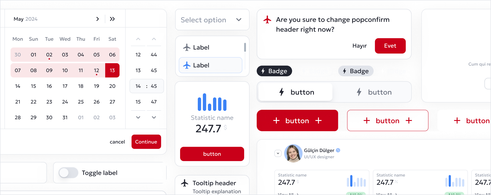

# Spar

An open-source Headless React UI library delivering unstyled, behavior-first primitives.
Zero styling opinions, full accessibility built-in.



[](https://www.npmjs.com/package/@turkish-technology/spar)
[](https://www.npmjs.com/package/@turkish-technology/spar)
[](https://github.com/turkishtechnology/spar/blob/develop/LICENSE)

## Installation

```bash
pnpm add @turkish-technology/spar
# or
yarn add @turkish-technology/spar
# or
npm install @turkish-technology/spar
# or
bun add @turkish-technology/spar
```

## Documentation

For full documentation, visit [Documentation Guide](https://spar.app.turkishtechlab.com/).

## Contributing

Please see [CONTRIBUTING.md](../../CONTRIBUTING.md) for contribution guidelines.

## License

See [LICENSE](../../LICENSE) for details.
